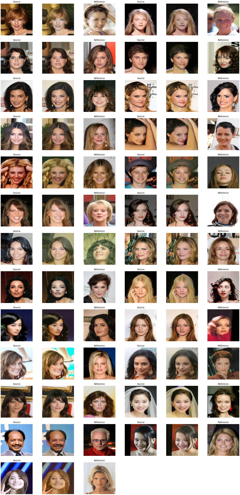

# StarGAN v2
A Pytorch implementation of [StarGAN v2: Diverse Image Synthesis for Multiple Domains](https://arxiv.org/abs/1912.01865) trained with CelebA dataset.  

> Kaggle Notebook: [Link](https://www.kaggle.com/code/kimjiyeop/stargan-v2/)

## Implementation Details
```
Training on Kaggle GPU for 32 hours

dimension
 - style vector (s): 64
 - latent vector (z): 64
 - feature map (f): 64
 
number of domains: 2 (male / female)

loss weight:
 - gradient penalty = 1.0
 - style reconstruction = 1.0
 - diversity sensitive = 1.0
 - cycle consistency = 1.0

optimizer: Adam
 - learning rate = 1e-4 (1e-6 for mapping network)
 - betas = (0.0, 0.99)
 - weight decay = 1e-4
 
epoch: 5
batch size: 8
number of train images: 182637
→ total iteration: 114150
```

## Outputs for images in test dataset
### Good outputs
<p align="center">
  
</p>

### All outputs
<p align="center">
  
</p>
